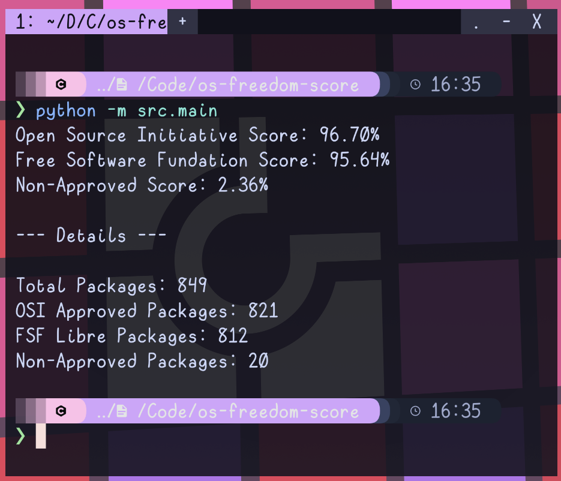

<h1 align="center">
  OS Freedom Score
</h1>

<h4 align="center">A python script to classify installed packages licenses</h4>

<p align="center">
  <a href="#about">About</a> •
  <a href="#usage">Usage</a> •
  <a href="#todo">Todo</a> •
  <a href="#credits">Credits</a> •
  <a href="#license">License</a>

  <br><br>

  
</p>

## About

A python script to classify installed packages licenses in the terminal using:

- [SPDX License List](https://spdx.org/licenses/)

## Usage

```sh
git clone https://github.com/cassiofb-dev/os-freedom-score

cd os-freedom-score

python -m src.main
```

## Todo

- [ ] Add suport for [Pacman](https://wiki.archlinux.org/title/Pacman)
- [ ] Use GNU license list data
- [ ] Improve the license classification method

## Credits

- [SPDX License List](https://spdx.org/licenses/)
- [GNU License List](https://www.gnu.org/licenses/license-list.html)

## License

MIT
